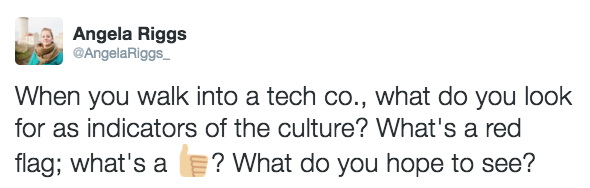

A few weeks ago, I joined some of my Toads at the first [TechTown Change Agents](https://www.eventbrite.com/e/techtown-change-agents-series-1-tickets-23120917286), an event put on by Portland Development Commission to talk about how we can bring diversity, inclusion, and equity to our workplaces. One of the most interesting conversations revolved around the topic of culture. What makes up a company’s culture? How can a company show their culture? What culture indicators are already in place, and do they accurately represent the culture we have and/or want?

I decided to take the question to Twitter.

As I’ve [written about previously](http://mathys-potestio.com/a-developer-tweets-to-build-community-and-understanding/), Twitter can be a fantastic community for collaboration, conversation, and knowledge-sharing. I was curious to hear what some of the tech community had to say on the subject - and sure enough, the insights and ideas came flooding in! It was interesting and enlightening to hear people’s thoughts on culture indicators, and the conversation has given me some great insights on how Metal Toad can make sure we not only continue to create a positive and inclusive culture, but also make sure we effectively communicate that culture to people.

## Culture as People

Some people who responded talked about **culture as people**. When we talk about culture as it relates to the people of a company, it’s a fairly common view that we want to see diversity of all kinds. Hiring diverse people is an indication that a company values and embraces differences; they appreciate and thrive on their differences, and acknowledge the positive nature of having people with different life experiences, backgrounds, and ideas. When a guest or potential employee walks through the doors of a tech agency, they want to see people like them. They want to feel, to be reassured, that their culture is part of the company culture; that their values are shared by others; that their perspective is appreciated and encouraged. If a tech agency is made up solely of white males between the ages of 23-30, anyone not falling into that combination of traits would likely feel lonely; a lack of empathy; a lack of commonalities and inclusion. (Please note that I’m not making a blanket statement that “white men in their late 20s lack empathy”. I’m simply offering a not-unlikely scenario that would cause many people to feel uncomfortable and unwelcome.)

Some of the responses about *culture as people* included:

* How many young parents are there?
* When I joined [my company], one thing that stood out to me was how many men/women were eating lunch w/their kids in the cafeteria.
* Mixed age teams are a good signal to me.
* Different ages / colors / gender. People not all wearing plaid. A dog.
* I hope to see people from underrepresented groups in management; I’m wary of places that lack diversity of all types
* Age range is really important. I want to see that experience and wisdom are valued.
* People that don’t look like me.
* Red flag: lack of age range, gender, and color.

## Culture as Physical Environment

Many responses also talked about the culture as environment. I think some of these stem from the now-stereotypical tech company “bro” culture. It’s absolutely possible for a company’s environment to include some of the “red flag” items listed below; the critical issue is whether these things serve as the sole representation of a company’s culture, or whether they are simply part of the whole. For instance, Metal Toad has an arcade and a foosball table. I don’t really play foosball, but it’s an enjoyable way for some Toads to hang out with each other or take a break from work; and I do take advantage of the arcade - there’s a group of us here that play Towerfall, and it’s a fun way to connect with my coworkers.

I've also been seeing a lot of conversation happening around alcohol, and the type of culture that it can encourage. Metal Toad does have a kegerator, and there are employees that enjoy a beer at the end of the day. However, I have not seen an environment being created where people are pressured to participate in social drinking. I currently am choosing not to drink alcohol, and the way my coworkers interact with me hasn’t changed. There’s a difference between a workplace that puts emphasis and importance on how much or whether people drink, and a workplace that offers beer and wine for employees to partake of in a responsible way.

This is not to say that all companies should offer alcohol, or that kegerators should be an expectation of tech agencies. It’s a personal choice that each company and its people should make for themselves; but if a tech company does choose to offer alcohol, then it should be done without pressure or expectations of drinking to fit in.

A big part of an agency's environment is the physical placement of desks and workspaces. When it comes to office layouts, the general consensus seems to be a moderate mix of open desks for easy collaborating, along with more private spaces for head’s down time or quieter working conditions. Metal Toad has done pretty well with this (full disclosure, I say this as one of the louder people on the floor; although I feel that most people have come to accept my laugh as a way of life at this point.) Having recently transitioned to full Agile teams, we’ve rearranged desks into pods of 6 across the floor, and each team has a dedicated meeting room. The pods encourage quick collaboration throughout the day as needed, while the meeting rooms mean that people can meet for longer periods of time, or have a place to work if they want some quiet time for a bit.

As a result of this conversation on Twitter, I’ve been inspired to help make sure Metal Toad’s environmental culture is welcoming to as many people as possible. We are more than a kegerator and a foosball table, but those items are some of the only indicators we have of culture as environment. I’d love to see a Toad Life Wall, with photos of the people (and pets!) that make Toads happy. We also have a library of sorts in one of our rooms, currently stocked with technical and educational texts. Some Toads use that room for taking a break and reading during the day, so I would love to see us incorporate a lending library, where Toads who enjoy reading can find new books to explore.

Some responses around *culture as environment* included:

* Good: offices with doors.
* Collaborative work spaces; places and stuff to celebrate people.
* Thumbs-up: Low wall cubes, quiet rooms, and collaboration areas.
* A combination of open workspace to foster collaboration, balanced with quiet workspaces for those needing quieter head’s down time.
* Red flags: Nerf guns and a hard sell about “how fun it is”.
* Bad: hammocks, nerf guns, beer bottle collections on desks.
* Can be a red flag: liquor on desks
​* If there’s a ping-pong table, a better-looking kitchen than work areas, or catered food; I run away.
* Run if it has a beer tap or ping-pong table.

## Culture as Behavior

In addition to *culture as people* and *culture as environment*, some of the responses were a mix of the two. I call this **culture as behavior**: how people act, or are encouraged to act, in the workplace. It may seem tenuous or hard to define, but most workplaces have a vibe that you can get a sense of when you walk in. Are people interacting in common spaces, or are they avoiding each other? Do people smile at you or each other as they pass by? Do people’s body language indicate tension and frustration, or are they generally relaxed?

At Metal Toad, we tend toward being social if you’re sharing the lunchroom with other people, but it’s also accepted if someone is reading or on their phone. Many people at Metal Toad tend to work with headphones on; but we're also fairly active in Slack - so headphones are used for enjoying music, rather than for avoidance of communication or people.

A few of the culture as behavior responses were around communication behaviors: companies showing that they care about their people, diversity of opinions, and being able to talk about stressors or concerns without fear. Speaking as a developer at Metal Toad, I appreciate the various opportunities that we are offered for sharing our voices. We have a monthly all-hands developer meeting where we have a general scrum format (what’s going well, what isn’t), but where we can also talk about things we want to change, and discuss how to solve problems. It’s not just a complaining session - we come away with specific action items, steps to take for solving a problem, and someone taking charge of those steps. Conversations range from office layout, to issues with project processes, to pay and benefits. Some of these topics are controversial or scary to talk about, but Metal Toad continually works to create a culture and environment where people feel safe doing so.

We also have a company-wide standup every Monday. Part of the standup includes reports about how the business is doing, clients and work that we’re working to line up, and company goals. There’s a lot of transparency around how and what Metal Toad, as a company, is doing; and being open about the company helps to foster a culture where people feel safe doing the same. There’s time during the standup for raising cultural concerns, whether it affects one person or everyone. When someone raises a concern, we take time to discuss it at standup, and our executive team also makes time during the week to meet with that person and make sure the concern is addressed.

Everyone’s favorite part of standup is the time for fistbumps and high-fives. This is the time to give a shoutout or compliment to someone; to acknowledge the value of your fellow Toads. Fistbumps are given for such a wide variety of reasons: a nicely written piece of code, helping with kitchen duties, organizing an after-hours event, troubleshooting a tricky issue… the list goes on and on. We also have a #shoutouts channel in Slack, where we can throw out mini-celebrations of Toads all day as they happen. Toads are encouraged to create this positive environment for each other, to show their appreciation and recognize their colleagues’ value.

Some of the responses around *culture as behavior* included:

* How relaxed everyone seems. If they get snarky towards anyone else. If anyone looks uncomfortable or is faking enthusiasm.
* If stress is talked about openly without burden.
* If they seem to have values and show care about things, and about people.
* I like to see a little bit of chatter among the team members, even when they’re programming; not head’s down all the time.
* I look for diversity in opinions. Really valuable thing for me.
* I try and read the vibe; are people super tense, or more relaxed but focused?
* Sometimes/often red flag: everyone with headphones; late starts, late nights.
* When did people go home last night?

## Creating the Culture

A company's positive culture isn't something that just happens. Creating an inclusive, diverse, and supportive culture requires mindful planning and focused goals; and it encompasses such a wide variety of characteristics. Culture as environment can be easier to implement (throw in a few potted plants, stack some books in the lounge, make the desk areas look good), but it means nothing if the company isn't also dedicated to including a diverse range of people within its walls. And a company can begin to create a positive culture as people through mindful hiring practices; but if employees aren't actively supported and encouraged share their views and ideas, that culture will quickly begin to decay. Each type of culture that I've talked about here - culture as people, culture as environment, and culture as behavior - is just part of the whole philosophies and actions that make up a company's culture. For instance, Metal Toad's encouragement of showing appreciation is one of our strongest indicators of a positive culture, but it's also one that you wouldn't be aware of unless you were already part of the Toad family. Companies need to acknowledge and embrace the varied depths and nuances of culture, and make a conscious decision to work toward creating the best culture possible.

And it's not just a one-time decision. Creating a thoroughly positive culture is a continuous work in progress, and needs to take place across all layers of the company. It won't always be an easy process, and there will be lots of learning experiences along the way - but the company you become as a result will be well worth the efforts.

*What are some positive culture indicators that you or your company have put into practice? What are you proud of, or what are you working to change? What are some lessons you've learned about creating a positive culture?*

*The Twitter conversation around culture included contributions from: @concreteniche, @kwuchu, @karmajunkie, @Brigette_Eckert, and @robdel12. Many other people also contributed via Twitter, but I am erring respectfully on the side of caution by keeping people anonymous if they haven't expicitly given requests for attribution. However, I am happy and willing to update this post with proper attribution as those contributors make their wishes known!*

