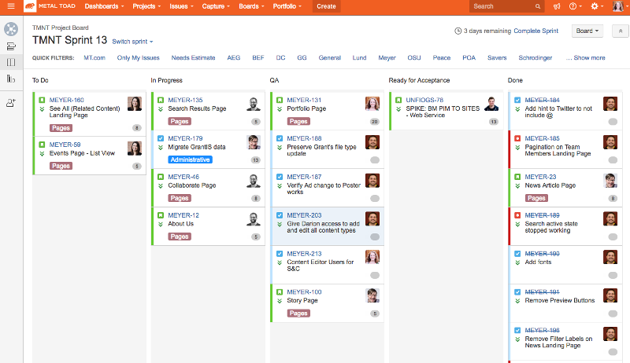

One of Metal Toad’s continuing goals for developers centers around mastery. There are some [high-level ideas and objectives](http://www.metaltoad.com/blog/sense-of-software-craftsmanship) around this, but part of reaching mastery has to do with enhancing and maintaining the code quality of our projects. We’ve put some workflows in place for our projects, including changing the way we deploy and QA. Teams at Metal Toad function fairly autonomously, with the ability to create the tools and processes that work best for them; so I’ll be speaking for my team, as the QA Engineer for Team Mutant Ninja Toaders (TMNT).

## Jira workflow

First up in our conversation - let’s talk Jira! Who else hates that damn Issue Detail View?

Issue Detail View aside, our team has established a pretty solid workflow for our sprints in Jira. From the screenshot below, you can see the columns we use to categorize our board. It looks like there’s a lot is going on, but the separation of columns helps us keep track of ticket responsibility, and ensures two passes of quality assurance before a ticket is considered ‘Done’.

## QA Column

When a developer is ready for their work to be reviewed, they transition the ticket from 'In Progress' to 'QA' and make a Pull Request (PR) in GitHub. As the QA Engineer, my lofty goal is to QA tickets within 24 hours. As a less experienced developer, I take a look at the code but concentrate on functionality, which is called grey-box testing. If everything is functioning as intended, I add a comment to the ticket that it’s ready for a code review, and one of our more experienced developers will do a more thorough code review. At that point, it either passes QA and transitions forward to 'Ready for Acceptance'; or it’s determined that QA has not been met, and the ticket transitions back to the 'To Do' column. If the ticket moves forward to 'Ready for Acceptance', the Pull Request is merged, and the work is merged from the feature branch to the dev branch.

## Ready for Acceptance

‘Ready for Acceptance’ is a relatively new addition to our workflow. Whereas the QA column is my domain, the 'Ready for Acceptance' column belongs to our Project Managers and Product Owners - the Toads in charge of verifying that the finished item meets the clients’ desires and needs. If we all laid our groundwork correctly, the acceptance criteria was detailed in the ticket and used by the developer while working, so it’s rare for work to stumble at this step in the workflow. Once the Project Manager or Product Owner gives their final :thumbsup:, the ticket can be moved to the 'Done' column.

## Github

In the previous section of this article, I briefly mentioned Pull Requests (PR). As of this writing, all projects at Metal Toad follow a version control workflow that includes PRs as a stage gate to changing a project’s codebase. The ability to approve and merge a PR is limited to Senior Developers and above; this follows the standards of our Career Matrix, which states that Senior Developers: lead code reviews and communicate best practices, and enforce review coverage as stories are closed. Through Pull Requests, everyone can easily see what code was added or modified by the work, which has several benefits:

* Learning experience: allows developers to see how someone else solved a problem
* Peer support: allows developers to coach and give feedback to their peers
* Quality review: puts another pair of eyes on the work, which helps ensure code quality standards

Using PRs also means we can clearly see when a merge conflict is imminent. We’ve also recently added a PR template for our Github repos, which makes my QA Engineer heart flutter. Specifically, there’s a section with ‘Instructions to QA’, where the developer who did the work includes the necessary steps for QAing the ticket. This small but important detail means I can easily QA the work, and ensure I’m covering all of the bits and pieces of the site that may be affected by that ticket.
