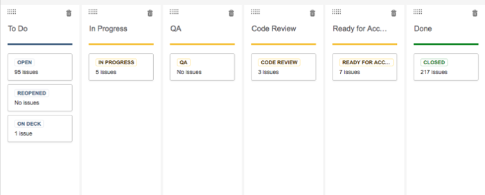

At Metal Toad, where self-organizing and self-managing teams are encouraged (and even preferred), there is a lot of room and trust for individuals to make change. Because of this empowerment, I’ve had the privilege to try out and implement changes. Not all of my attempts have been successful, and some have benefitted from iteration, but it’s pretty cool to know that the opportunity to affect change is something that’s offered and supported here.

## Team Workflow

As my team’s first quality assurance (QA) engineer, one of the first changes I implemented was our Jira board workflow. When I first started, we didn’t have consistent QA, so there wasn’t a need for a structured process that included it as a step.

Part of the problem was knowing when a ticket was ready for QA. This is what project boards looked like when I first started:

Three columns: To Do, In Progress, and Done. So — how do I know when to QA a ticket? For sanity’s sake, I close my email down during the day, so I wouldn’t get Jira email notifications. Checking the ticket for updated comments is tedious, and would also depend on the developer remembering to add a comment when they’re done working on it. None of those options were reasonable or desired solutions, so I decided to add a QA column to the board. When a developer is done working, they drag the ticket over to the QA column, and it’s easy for me to see when work is ready for me.

But then we had the same issue with code reviews, and acceptance reviews from our Project Managers or Product Owners. At first, we wanted to avoid overcrowding the Jira board with too many columns. I tried using generic placeholder tickets in the QA column - everything above it needed QA from me, and everything below it needed code review from another developer. But Jira is not always a nice tool, and tickets often ended up in the wrong place.

So to make our workflow as intuitive as possible and simple for everyone, I added one column per area of responsibility. It’s not a huge change, and it involved a lot of tedium with Jira finagling, but it made our days a lot easier.

Nobody liked the existing workflow, but nobody had the time or inclination to change it — except me. I tweaked the current process to fit my own needs, and then iterated further to make it better for everyone.

## Job Descriptions

Last year, we started an Inclusion Special Interest Group (SIG) at Metal Toad. One of our first goals was to create better job descriptions for some of our open roles, and I worked with a few of my fellow developers to brainstorm what we wanted for a Senior Developer role. We thought about the actual day-to-day knowledge and skills we needed, both soft skills and tech skills, and reframed the language to be more direct about the values we were looking for, but less specific about technology stacks.

We did research about gender bias as it related to job postings, and we were mindful of word choice and requested areas of skill and growth. We also ran our job postings through Kat Matfield’s Gender Decoder for Job Ads, and made further adjustments based on its feedback.

Once we had the language and requirements hammered out the way we wanted, and reflecting the values and skills that we thought were important, we presented it to our Director of Development as a finished item, but requesting his input. Once we got his feedback, and adjusted some items to match, it became the official job description! This project was self-started — it wasn’t initiated by any of our directors or execs, and we didn’t ask for permission or input to start with. We decided it needed doing and we did it; we went up the chain of command when we were ready for the review, and for the sign-off needed to implement our ideas.

## Documentation

As a QA engineer on a team with over 15 ongoing projects, I have to context-switch A LOT. In theory, the setup and management for all of the projects are pretty similar. In reality, there are enough quirky differences and one-off scenarios that some things are just not intuitive, or transferable between projects.

Everyone likes to have documentation, but it often doesn’t get written for a variety of reasons. It can be hard to context-switch between writing the code and writing the docs; you think you’ll get to it later, you hate doing it, you don’t feel like you have time to get it done. When I started on my team, the READMEs for our projects were in various states of disarray — a handful had complete READMEs, some had a few sections filled out with TODOs scattered in there, and some had nothing more than the repo name.

In this case, I changed by example — as I created testing repos, I made sure to include READMEs and asked for review on them. I created a team directory in Google Drive to house various project documentation that was separate from READMEs, and put all of my test reports in there. I made sure to um, firmly request documentation from other developers if there was information that other people really needed in order to do their jobs — including me, for QA.

## How I Made it Work

Creating change isn’t always easy — change management is one of the hardest skills for people and organizations. Not all of my attempts have been successful (or popular, thinking of the Great Desk Rearrangement of 2016), but many of them have been at least well-received, even if they failed. Here are some reasons that I think I’ve had success:

- It can be easier for an individual or small group to push change forward than a committee or whole organization. If we had asked for the job description to be a top-down change, it would have moved a lot slower, because the people working on it would have had to fit it in among other responsibilities. It was a priority for us, so we were able to commit the time to it and get it done.

- Sometimes it is better to ask for forgiveness than permission. I checked with our Project Managers about the changes to Jira, but presented it as more of a done deal when talking with the team.

- Remember that other people can benefit (or be blocked) by your change. Everybody benefited from the changes I made to our Jira board, but meddling in teams’ or people’s workflow could have been risky.

- Be open to iteration and feedback. It’s likely that any changes you make at a company are going to affect other people in some way. Be receptive to understanding it from their point of view, and either rolling back or iterating on your changes.