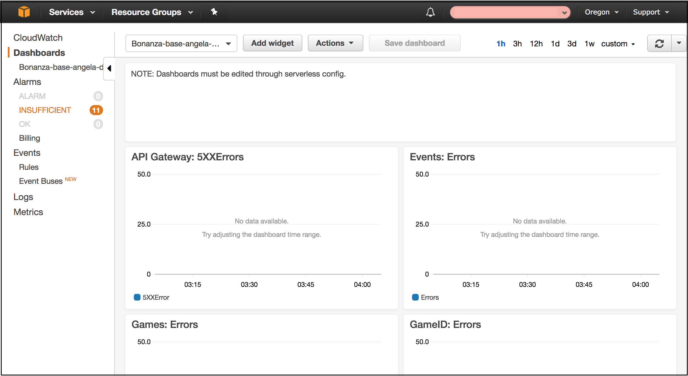
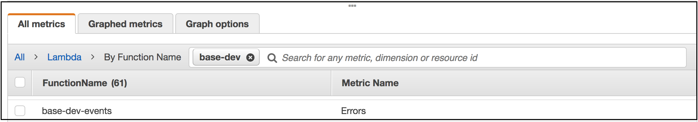
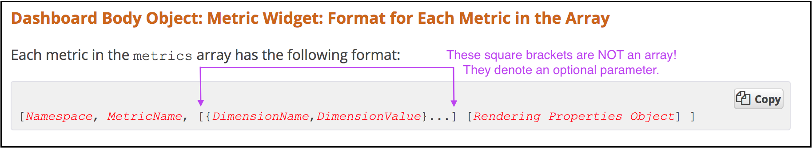
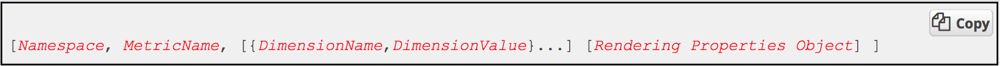

My team’s most recent project has been really interesting - it’s a JavaScript project that includes using the Serverless Framework to deploy a variety of AWS Lambda Functions (e.g. uploading to S3 buckets and making requests to the API that we built). Part of my responsibility as QA Engineer was to set up a CloudWatch dashboard in AWS. Dashboards can be created manually in the CloudWatch service, but I wanted to create the dashboards through code deploys.

Prior to this project, I had zero experience working with AWS, so I was really excited to dig in and get started. I spent a few days this week going through documentation and writing the code, and I successfully deployed my dashboard on Thursday! I also added an alarm for one of the metrics, and created a separate monitoring board through LogicMonitor. I had a lot of fun getting this work done! I want to share some of the technical documentation pitfalls that I came across, how I got past them, and in general how to set up the configuration for deploying an AWS CloudWatch dashboard through code.



## Getting Started with Documentation

I started with the documentation for [AWS Resource Types](http://docs.aws.amazon.com/AWSCloudFormation/latest/UserGuide/aws-properties-cw-dashboard.html), specifically the AWS::CloudWatch::Dashboard section. It gives both JSON and YAML examples (as does most of the documentation), but the YAML really only takes you so far, as you’ll see in a bit. I started with the YAML, since that’s what our Serverless config uses - plus YAML is just so nice to write (I always end up losing track of curly braces in JSON!). That got me to the very tiny beginnings of my config:

```
Type: "AWS::CloudWatch::Dashboard"
  Properties:
    DashboardName: String
    DashboardBody: String
```

From there, the docs took me to [template snippets](http://docs.aws.amazon.com/AWSCloudFormation/latest/UserGuide/quickref-cloudwatch.html#cloudwatch-sample-dashboard-sidebyside) for the CloudWatch Dashboard, where I realized that I need a line ahead of what I already had. Here’s your first tip: The line above the `Type` property can be whatever you want. I didn’t really have any YAML experience before this, so perhaps that’s more well-known, but I started with their naming example in my code. The docs also don’t mention the naming standards for the DashboardName property, but take note that it doesn’t accept spaces (which I only found this out after trying my first deploy). I ended up with:

```
DashboardSideBySide
  Type: "AWS::CloudWatch::Dashboard"
    Properties:
      DashboardName: Bonanza-Dashboard
      DashboardBody: ’{}’
DashboardSideBySide
```

The snippet example for `DashboardBody` is largely unhelpful - it’s such a pain to scroll horizontally through a giant JSON object! It’s basically unreadable in that format. I rummaged around in the documentation some more, and I honestly don’t remember how I found the next useful page. But of course I’ll link to it for you: [Dashboard Body Structure & Syntax](http://docs.aws.amazon.com/AmazonCloudWatch/latest/APIReference/CloudWatch-Dashboard-Body-Structure.html). This is the real meat of the dashboard config. This was a fairly straightforward copy/fill out scenario, with a couple of exceptions.

## Metrics Array

First, the `metrics` array: Under the section titled “Dashboard Body Object: Metric Widget: Format For Each Metric in the Array”, it gives the format and describes what each of the items are: Namespace, MetricName, DimensionName, DimensionValue. I had already come across the docs for [metric dimensions](http://docs.aws.amazon.com/AmazonCloudWatch/latest/monitoring/lam-metricscollected.html), so I knew that each of our Lambdas have four Dimension Names (Errors, Durations, Throttles, and Invocations), and I used `FunctionName` for the DimensionValue property. I found the FunctionName by going to CloudWatch > Metrics > Lambdas > By Function Name. So that got me to my `MetricName`, `DimensionName`, and `DimensionValue` values, but what the heck is the `Namespace`? I couldn’t find it anywhere! Fortunately, I did some random things and managed to notice when I got to a page that had the Namespace listed - and if you have a better way, please leave a comment about it! My steps were: CloudWatch > Metrics > Lambdas > By Function Name to the list of lambdas. The lambdas are listed in a window with three tabs: All Metrics, Graphed Metrics, and Graph Options. Check the box for a metric, and notice the (1) appear in the Graphed Metrics tab. Go over to that tab, and you’ll see a bunch of info about the metric you selected - including the Namespace! I stumbled on this purely by accident - there definitely has to be another way.



So this brought my config to:

```
DashboardSideBySide:
      Type: AWS::CloudWatch::Dashboard
      Properties:
        DashboardName: "Bonanza-Dashboard"
        DashboardBody:
          '{
            "widgets":[
              {
                "type":"metric",
                "x":0,
                "y":0,
                "Width":12,
                "Height":6,
                "properties":{
                   "metrics":[
                      [
                         "AWS/Lambda",
                         "Errors",
                         "FunctionName",
                         "base-dev-events"
                      ]
                     ],
                     "period":60,
                     "stat":"Sum",
                     "region":"us-west-2",
                     "title":"Events: Errors",
                     "view":"timeSeries",
                     "yAxis":{
                       "left":{
                         "min":0,
                         "max":50
                     }
                   }
                  }
                }
          }'
```

## Documentation Pitfalls

Well, kind of.

That config code snippet is post-pitfall (I promised you there’d be pitfalls!). See that `metrics` array up there? (The one with the `NameSpace`, `MetricName`, and `Dimensions` that I was talking about in the previous section.) My deploy initially failed with reference about “The dashboard body is invalid; ErrorCode: InvalidParameterInput”, and I just couldn’t figure out where I’d gone wrong. Keith, one of my colleagues, came over to help troubleshoot, and we spent a few puzzling minutes agreeing that it really looked like it should work. Then Keith had a fantastic troubleshooting insight, and we realized that the documentation was using square brackets to indicate an array AND to indicate optional parameters within that same array!

Here’s the documentation:



his was such a facepalm moment. Scrolling down to the docs section for each item verified that yes - NameSpace and MetricName were required, whereas DimensionName and DimensionValue were not.

So I adjusted my config to remove those extra square brackets, ran the deploy, and got ready to enjoy looking at my beautiful dashboard.

Well, not quite.

Now the deploy failed with a reference to invalid JSON. Fair enough - I’d been switching some things around, and it’s easy to lose track of curly braces and square brackets, so I ran my code through a linter. `Expecting ':', got ','`. I took another look at my code, and then at the documentation.



Sure enough, they DID use a comma instead of a colon! `{DimensionName,DimensionValue}` should be `{DimensionName:DimensionValue}`. Easy fix, and I’ll be on my way to a successful deploy…

Well, almost.

That took me back to the “dashboard body is invalid” deploy failure. It turns out that the _comma_ is correct. It’s the _object syntax_ that’s wrong! Those curly braces do not belong there at all. I figured it out by just looking at the docs and thinking, “What if the technical writer just made a mistake?” None of the other items on the same level were separated into different objects, so why would these be? So I just took them out and tried a deploy - sure enough, that’s what the blocker was. Please let my pain help you have a better experience - ignore those curly braces.

## Final Config

I left everything else as default. I chose a 12-column width for each metric widget because I wanted the dashboard to have two columns of widgets, to make it easier to skim the info in a single glance. After adding a text widget, and some tweaking to fix widget placement within the dashboard, this is what I ended up with as my config:

```
MetricsDashboard:
      Type: AWS::CloudWatch::Dashboard
      Properties:
        DashboardName: "Bonanza-${self:service}-${opt:stage}-dashboard"
        DashboardBody:
          '{
            "widgets":[
              {
                "Type":"text",
                // "x" is where (out of 24 columns) the widget will be placed.
                // 0 means the far left.
                "x":0,
                "y":0, // this places the widget at the top of the dashboard.
                "width":24,
                "height":3,
                "properties":{
                   // A nice note for other devs
                   "markdown":"NOTE: Dashboards must be edited through serverless config."
                }
              },
              {
                   "type":"metric",
                   "x":0,
                   "y":1,
                   "Width":12, // So this widget will take up half the dashboard width.
                   "height":6,
                   "properties":{
                      "metrics":[
                       [
                          "AWS/Lambda",
                          "Errors",
                          "FunctionName",
                          "${self:service}-${opt:stage}-events"
                       ]
                    ],
                    "period":60,
                    "stat":"Sum",
                    "region":"us-west-2",
                    "title":"Events: Errors",
                    "view":"timeSeries",
                    "yAxis":{
                      "left":{
                        "min":0,
                        "max":50
                    }
                  }
                 }
              },
              {
                 "type":"metric",
                 "X":12, // This widget will start at the halfway point of the dashboard width...
                 "y":1,
                 "width":12, // ...and take up half the dashboard (12/24 columns)
                 "height":6,
                 "properties":{
                    "metrics":[
                     [
                        "AWS/Lambda",
                        "Errors",
                        "FunctionName",
                        "${self:service}-${opt:stage}-games"
                     ]
                  ],
                  "period":60,
                  "stat":"Sum",
                  "region":"us-west-2",
                  "title":"Games: Errors",
                  "view":"timeSeries",
                  "yAxis":{
                    "left":{
                      "min":0,
                      "max":50
                  }
                }
               }
            },
            {
             "type":"metric",
             "x":0,
             // all metric widgets go under the text widget
             // so each metric widget has a "y" value of `1`
             // vs the text widget’s value of `0`.
             "y":1,
             "width":12,
             "height":6,
             "properties":{
                "metrics":[
                   [
                      "AWS/Lambda",
                      "Errors",
                      "FunctionName",
                      // We can deploy with different services and stages,
                      // so now the dashboard will display whatever service/stage was deployed
                      "${self:service}-${opt:stage}-searchteams"
                   ]
                ],
                  "period":60,
                  "stat":"Sum",
                  "region":"us-west-2",
                  "title":"Search Teams: Errors",
                  "view":"timeSeries",
                  "yAxis":{
                    "left":{
                      "min":0,
                      "max":50
                  }
                }
              }
            }
          ]
      }'
```

NOW I had a successfully deployed dashboard! If you’re interested in setting up a metric alarm in AWS, you can find the docs for that [here](http://docs.aws.amazon.com/AWSCloudFormation/latest/UserGuide/aws-properties-cw-alarm.html); and if you want to set up a separate alarm in LogicMonitor, you can find the docs for that [here](https://www.logicmonitor.com/support/monitoring/cloud/adding-your-aws-account-to-logicmonitor/) and [here](https://www.logicmonitor.com/support/monitoring/cloud/aws-configuration/). I honestly had just a ton of fun getting to figure this out - I hope my experience makes your configuration go a little more smoothly!

_**Have you worked with AWS or Serverless before? What cool stuff have you done - or what pitfalls have you found? Leave a comment and let me know!**_

