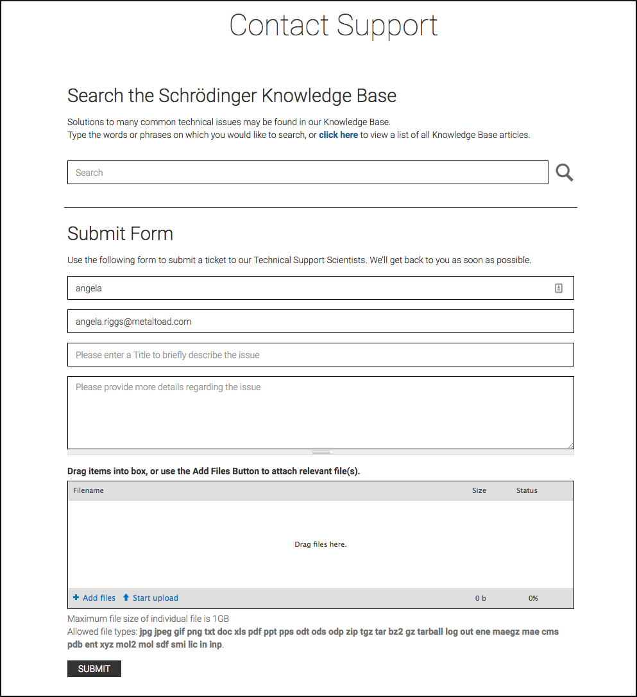
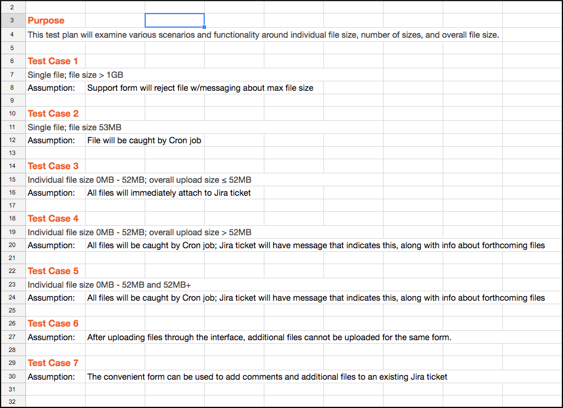
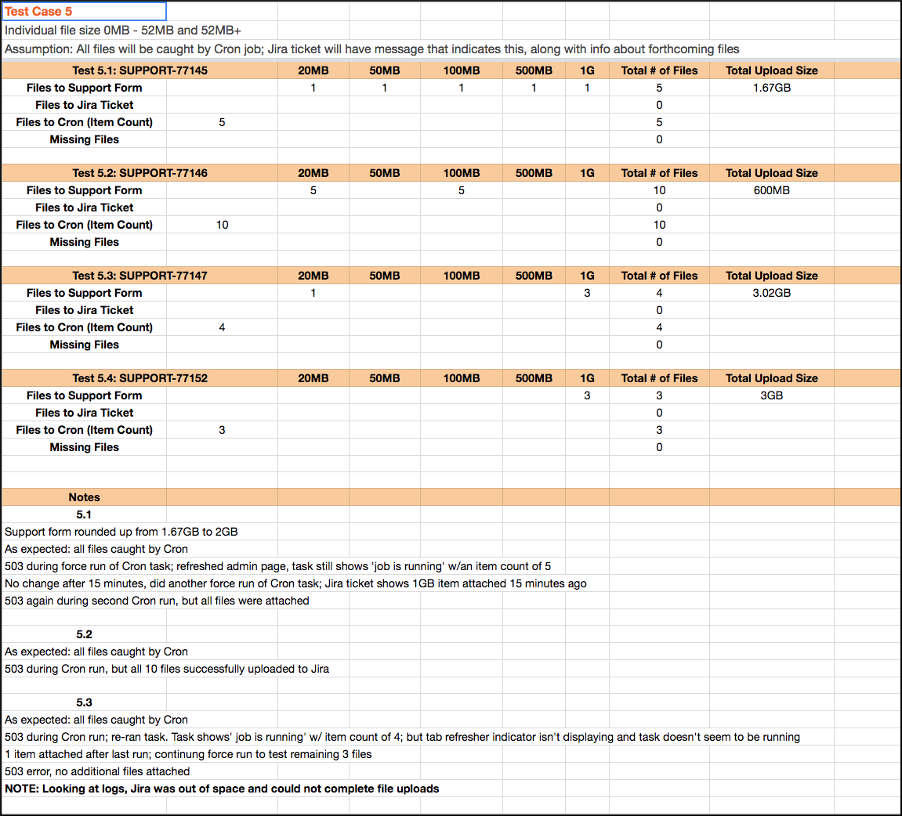

Last year, our VP of Engineering came to me with a request. One of our long-term clients was having continued issues with the functionality of a website feature, and Tony needed me to do some investigating to figure out why the failures were happening, as well as make recommendations for fixing it.

## The Feature

This client creates proprietary modeling software for scientists, and the website we built includes a Support Form that customers can use to report issues with the software. The Support Form creates Jira tickets for their Technical Support Scientists, and is only available to logged in users. Once logged in, the user must fill out fields for name, email, title, and description. They can optionally add and upload files.

The Support Form has undergone several iterations to improve functionality, user experience, and performance. In its original implementation, submitting a Support Form with attached files uploaded all of the files immediately, and in their entirety. This meant that the form was uploading up to 52GB of files in single go. In a later iteration, we put Cloudfront in place to help with file storage. As a consequence, some file submissions started to fail - Cloudfront has an automatic 30-second timeout, and multiple or larger file uploads were taking longer than that. To counter these failures, we decided to “chunk” the attachments. When the form is submitted, a Jira ticket is immediately created. Uploaded files are either attached to the ticket, or caught by a Cron job, which uploads portions of the files until all file attachments are complete. This “chunking” upload method, rather than uploading all at once, avoids the Cloudfront timeout.

When Tony came to me about creating a test plan, there were a few ongoing issues that our clients were concerned about. The first was that file attachments were still failing to upload, and these failures seemed to be inconsistent; that is, there didn’t seem to be a pattern or specific scenario around these failures. Additionally, the Cron tasks responsible for checking on file attachments wasn’t running consistently. Behaviors around the form weren’t getting logged anywhere, so it was even harder to pinpoint where things were going wrong (or even where they were functioning as intended). And lastly, our clients had recently requested the ability for customers to upload new information and files to existing Jira tickets through a separate form that could be emailed to them.

So to sum it up, we had:
* Escalated client concerns
* Recent updates to the existing feature
* Lack of understanding around expected functionality
* Inconsistent failures
* Multiples types of failures

That doesn’t seem like a great situation to be taking over. So where do we start?

## The Client

Apart from any technical issues, we have a client who is feeling worried, and feeling a loss of confidence in the site and features we built for them. So the first thing I did was to email our clients and let them know I was making this a priority.

## The Expectations

In order to really test the things that were going wrong, I had to know what the expectations of functionality were. I spent some time with the code in the related modules that we had written, looked up the project Jira tickets that detailed the feature work and acceptance criteria, and talked with the developer who was largely responsible for the feature. The basic requirements of the Support Form were expected to be the following:
* Maximum overall file size of 1GB, regardless of how many files were being attached.
* If overall file size was less than 52MB, all files would upload to the Jira ticket when the form was submitted.
* If overall file size was 52MB or greater, some files would be uploaded to the Jira ticket immediately, while the others would be caught by the Cron job and uploaded in chunks until completed
* The Cron job would have a maximum interval of 10 minutes between runs
* Customers could be emailed a link to a new form, in order to upload more files and add comments to an existing Jira ticket

## The Test Plan

Back on the technical side, the first thing I did was to create a test plan. I wrote out a quick summary, much like the beginning of this blog post, to list out all of the failures that were happening. Then I distilled that plan down into 7 test cases, based on the assumptions that we were making about the expected functionality of the Support Form. The test cases included:
* Warnings about maximum file size
* Single file attachment, size 53mb
* Multiple file attachments, overall size less than 52mb
* Single file attachment, overall size greater than 52mb
* Multiple file attachments, each varying between 0-52mb and 52mb+
* Uploading additional files after the first round, but before form submission
* Using the email form to add comments and additional files to existing Jira tickets

For each test case, I detailed out at least 2 test examples with various parameters, including edge, boundary, and corner cases. In order to mimic the production environment as closely as possible, I ran all tests on our staging environment, since it was the only other environment set up with Cloudfront. This environment was also integrated with a test Jira account.

## The Documentation

In all, I ended up creating about 20 test case scenarios, and carried out the testing over a period of a few days. I wrote up a summary for myself, to make sure I understood the problems. As I tested, I detailed out the specifications for each test, as well as the assumptions behind them and the actual results. When it was done, I created a formal report that addressed the outcomes of the tests, as well as the solutions we implemented as a result.

Having all of the test case scenarios outlined and ready was really important for my productivity and efficiency. Thinking about the scenarios ahead of time ensured I was capturing all of the likely and unlikely ways the form could succeed or fail.

I also found and used a really handy command during testing. The `mkfile` command creates empty files of specified sizes, which is obviously helpful when testing dozens of file attachments and uploads. I created a folder for each of my test cases (e.g. `test-case-1`, and then used the `mkfile` command to set up the files I needed for each test (e.g. `mkfile -n 20m ~/Desktop/test-case-5/test3.pdf`).

Over and over, I hear documentation being something that developers hate. I hear that it takes too much effort, takes away from actual coding, it’s boring, it’s a pain.

Yep. All of those things. But the documentation is a really important part of the development workflow. It’s useful for yourself, as you go back and iterate over code you wrote - whether it’s an hour from now or a month from now, it’s easy to lose track of where you were in the thought process. Documentation helps give context to the work you’re doing. And if it’s useful to give yourself context - you, the person immersed in the actual work being done - think of how helpful it is to someone else! It lets other people understand your context and your thought process around the work they’re viewing.

## The Results

As a result of my testing, we found out where and why the Support Form was failing, and the code for the Support Form was refactored to offer consistent behavior. Now, when overall file size was greater than 52MB, all of the files would be caught by the Cron job and uploaded in chunks until complete. Additionally, the created Jira ticket would include messaging about expected incoming attachments. We also realized that the 1GB limit applied to individual files, not the overall file size.

One of the most useful changes was actually the simplest - setting up the Support Form to log behaviors through Watchdog. Both successes and failures would be logged, and tracked behaviors included the Jira ticket creation, ticket updates, and the file attachments. The logs made it so much easier to confirm expected behaviors, and to track down and troubleshoot errors. For instance, when I started getting 503 errors during testing, I could look at the logs and see that Jira was out of space and couldn’t accept any more files.

Once the first round of testing was done, and the improvements had been made and re-tested, I wrote up everything in a report. I included a high-level view of the problem and goals of the testing, as well as a description of my process, and a summary of the results. As a result of my work, the Support Form became a feature to be proud of - it was more consistent, better understood, and had improved functionality for both our client and their customers. The testing and subsequent improvements also served to reassure the client about our commitment to them, and allowed them to have more confidence in our company and our work.

***My intent is for this to be the first of a few case studies, where I dive a little deeper into specfiic testing experiences!***

