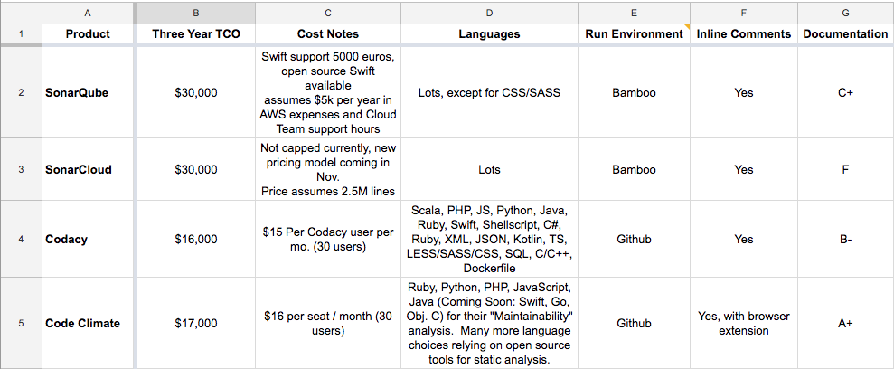

Recently, I helped spearhead our department’s adoption of centralized static code analysis. I worked with one of our mobile engineers to research various tools and create a decision matrix for comparing options. I’ve introduced [new tools](https://www.metaltoad.com/blog/backstopjs-part-deux-javascript-config-and-makefile) to my team before, but this was my first time selecting a tool that would be rolled out and used by my entire engineering department. It was also our department’s first time trying centralized static code analysis. Now that I’ve had the experience of researching and selecting tools that other people will use, I thought it would be interesting to lay out why we chose to implement centralized static code analysis, how we chose a tool for it, and maybe most important of all - how we introduced these changes to our department.

### Centralized Static Code Analysis

First, let’s cover why we decided to implement static code analysis in the first place. After an engineering offsite last year, Metal Toad set goals for creating a standard of quality throughout the company. Static code analysis - comparing written code against a set of “best practice” rules - is part of that process.

But why centralized static code analysis? People can just user linters in their text editor - why spend money and time for a new tool that does the same thing, and forces people to change their workflow?

One main difference is that local linters don’t offer standardization across people, teams, and projects. By running static code analysis via a single source of control (in this case, we’re using a product called Codacy), code rules are set at the project level, not the individual level - so everyone’s code is analyzed against the same set of rules.

Centralized analysis also offers visibility into the feedback. Programming is inherently collaborative, and our tools should support that. By using centralized analysis, the feedback is placed directly on the pull request in GitHub. This allows the team to have a better understanding of other people’s coding decisions, and prompts more conversation during code review.

### Choosing a Tool

There are several tools on the market for static code analysis. Before we could select one, we needed to think about our requirements. We threw together a Google Sheet with categories that we thought were important to consider: cost, run environment, inline comments, language support, and documentation.

**Cost:** We didn’t necessarily have a set budget in mind, but it had the potential to be a tie-breaker if we needed to choose between two tools.

**Run environment:** Our preference was for the analysis to be run through GitHub, ideally when a pull request was opened. This would cut down on the sweat and tears of installing a tool on our Bamboo server.

**Inline comments:** We strongly preferred inline comments - that is, analysis feedback directly on the pull request, instead of being forced to sign into a separate UI to view the feedback.

**Language support:** Metal Toad has a wide variety of projects. We needed support for .NET, Java, Kotlin, Swift, CSS/SASS, React, Ruby, and Python.

**Documentation:** Documentation for anything in engineering can be very hit-or-miss, and these were no exception. We graded with a gut check on an A-F scale, and the grades were A+, B-, C+, and F.

Of the four tools we compared, two had to be run on Bamboo, and two could be run through GitHub. All offered inline commenting, but one of the GitHub-based tools required a browser extension to do so. Not a big deal, but it meant an extra step for our engineers, so it was a mark against. Language support differences were negligible, except for one tool that excluded CSS / SASS analysis entirely. And when it came to documentation, most of the tools we looked at had decent enough docs for our purposes.

### Implementing the Change

So once we decided that static code analysis was important, and once we found a tool for it - how do you go about adopting it in the workflow?

First, you need buy-in. Without executive support, there’s no funding, and the project is over before it’s begun. You also need support at the manager level. Your managers can help make the case to your executives, but they can also help make the case to your peers. Lastly, you need buy-in from your peers. If the changes you’re introducing create FUD (fear, uncertainty, doubt), then they’ll push back and avoid the changes.

It can also be helpful to start small and iterate. We selected a few projects to start with, so we could have examples when we started rolling out static code analysis to the department at large. We worked with a few people for each project to set the code patterns - this meant that more people were invested in what we were doing, and it showed that we valued the input from people who would be using the tool we chose.

We were also very proactive in our communication. We let people know ahead of time that static code analysis would be rolled out, and we made sure to announce that we wanted to encourage feedback. And as much as possible, we made changes based on people’s feedback; where we couldn’t or decided not to iterate on feedback, we communicated why we made that decision.

### Expectations for Use

So we’ve talked about how we chose a tool for static code analysis, and why we think implementing it into our workflow is beneficial. But how does it actually get used day-to-day?

The messaging around expectations was particularly important for our engineers. Change is always hard. Change that points out mistakes and causes more work? Way harder. So it was really critical to have open communication around the expectations we had for people using this tool.

One of the most important steps was actually setting the code pattern rules for the analysis. This step was also a way to have people be more involved in adding static code analysis, instead of just throwing it over the wall at them. We scheduled meetings with 2-3 people in each group to set the default rules, so the input would be collaborative and cross-team. We focused on the more objective categories - Security, Performance, Error Prone, and Unused Code. We decided that Code Style rules would be set at a team level, since these tend to be more subjective and can be highly opinionated (tabs vs spaces! Single quotes vs double quotes!).

And throughout this experience, we were proactive in our communication around the *intent* of this tool. We emphasized that errors and issues would never block merges, and the analysis would never be used punitively. We explained that the intent was to improve our codebases with a focus on readability, security, and consistency. The goal was high-level best practices - the code we’d want other people to have written if we took over their project.

Overall, the experience of introducing and using centralized static code analysis has been pretty positive. There were some bumps along the way, to be sure. There was some frustration from adjusting to an extra step in the workflow, and we didn’t set up the code patterns as quickly as we could have, which led to some spamming from pull request feedback that we actually didn’t care about (e.g. those darn quote styles!). But by and large, I feel confident in calling this process a success - not only because of the benefits from static code analysis, but because I learned a lot from the experience.

### What I Learned

I didn’t have any previous experience around how to select a tool for internal use. This process gave me some insight into how to research and consider requirements, and how to present those in a meaningful way to the higher-up decision makers. It was actually fun getting to compare products and make the choice on the one we should implement!

My biggest lessons were about leading change management! Getting buy-in from both our exec team and our peers was so important. Investment from the top meant that we had the funding and credibility that we needed. Investment from peers meant that we primed the acceptance of adopting a new tool, and made it easier to pick up momentum of acceptance from everyone in the department.

We made sure to communicate. Nobody likes to be surprised with change, especially when it’s someone else’s choice. We told people in advance that this change was coming, so they’d have time to adjust their expectations and be ready for their workflow to change.

We kept our department mantra of “shoulder-to-shoulder” in mind. We didn’t just introduce the tool and wish everyone good luck - we created docs for onboarding, paired with small groups to set the code patterns and add projects, and invited feedback from engineers that we responded to.

Notice that almost every sentence in the section about change management starts with a “we”. That ownership over the changes you introduce is incredibly vital. For one, it lets people know who to go to with questions or concerns. It highlights the fact that when you introduce change, you are responsible for that change, and for its results. It’s also a reminder that you need to be invested in your change. You need to pay attention to how you’re introducing it, what the reactions are, and what the outcomes are. [Change is emotional](http://larahogan.me/blog/desk-moves), and you need to care.

*What are some pitfalls and successes you’ve experienced around change management or introducing new tools? Let me know in the comments!*
