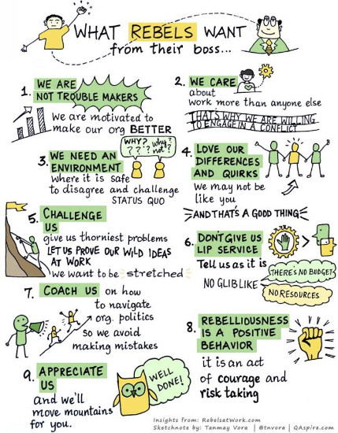

I saw this illustration make its way across Twitter recently, and it immediately resonated with me. This illustration perfectly captures how I feel and how I work, and what I strive for in my roles. It’s what I want every company, every manager that I work for to understand about me.

I want to work for companies who not only understand that I’m like this, but actively support and encourage my efforts. I want to work for companies who want their employees to care enough to suggest improvements and implement change. I always want my teams, my projects, my leadership to be the best they can be, and I genuinely enjoy putting in the work to help them succeed.

When you’re speaking truth to power - or asking power to speak truth to you - there are ways to do so effectively; and with empathy, respect, and maturity. The list below isn’t exhaustive, but it’s a reflection of the experiences I’ve had with being a rebel at work, and what I’ve learned about how to carry out those rebellions of advocacy and improvement.

**Advocating is as much about active listening as active talking.** Take the time to listen to peers and leadership, so you can communicate and advocate correctly both ways. And when you listen to the people who are involved, you increase your knowledge and awareness of the situation so you can help make good decisions.

**Work to understand the view from different levels.** Understand that people in different roles and different hierarchy levels don’t always have access to the same points of view. Part of the conversations you have should be about explaining your view and offering insights into the situation, as well as being able to draw out what other people are seeing from their side.

**Ask, don’t demand.** Lasting change requires buy-in and collaboration. Asking can sometimes take the form of strongly requesting, but if you have to demand involvement, your chances of success are much lower because people aren’t invested.

**Offer solutions, not just problems.** If you spend your time raising problems without contributing to the solutions, you start to move out of the useful Rebel at Work role into someone who just complains a lot. Be thoughtful about how you bring up situations that you want to change, and make sure you’re coming from a place of collaboration.

**Be open-minded, and ready for the possibility of changing your mind.** If you’re having effective and open communication, you’re learning more about the people and reasoning behind things. Once you’re introduced to a wider view, you may realize that it calls for different iteration - or even none at all. Treat your rebellions as learning opportunities - changing things is not the only way to be successful.

**Be patient - meaningful change is proved through actions, not words.** Significant, valid changes with buy-in across levels can be complex, and having the conversations is just the first step. Changes will likely occur in smaller increments, but even those can take time to actually put into motion. Be persistent, but balance with patience to see it through.
