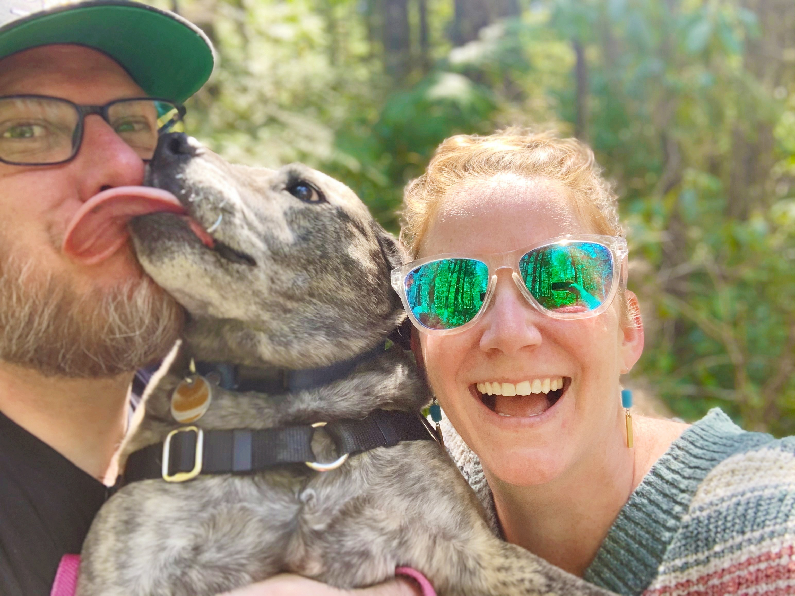

## 👋🏼 Hello!

Welcome to my manager README 🙂

## Context

As you open this doc and start reading through it, your first question is likely to be "What is a Manager README, anyway?"

That's a great question! I'm so glad you asked 😄 

In an ideal form, Manager READMEs can serve two purposes - as a tool for introspection, and as a high-level introduction. What things are important to me as a manager, and what bits and pieces are useful to share with you here?

However, when written without appropriate consideration, Manager READMEs can be a way for managers to avoid setting appropriate expectations, to ignore the need to build authentic trust and safety over time, or as an excuse for their own failure modes and refusal to adapt. Some people do not like Manager READMEs because of this, and they're not wrong - Manager READMEs that fall into these patterns are not good Manager READMEs.

I'm fortunate enough to have seen examples of good Manager READMEs from managers who care a lot about their craft; and I feel comfortable writing this, sharing it, and understanding what pitfalls to avoid. That being said - if you come across any of those pitfalls as you're reading, I hope you will let me know 🙂

## What This README Is (and Isn't)

This document is to help introduce me to you as a manager and as a human. It's intended to give you a starting point, but isn't intended to be comprehensive or be a replacement for us actually getting to know each other. 

Writing this helps me set my intentions for how you can rely on me as your manager, and it's a way for me to reflect on who I am and how I want to be as manager. 

This README is **not** intended to cover my goals for the department, or my expectations for you and your work.

I intend for this to be a living document. As I change and grow as a manager, so will the information here. There might also be things that are unclear to you as you're reading - I encourage you to call that out so I can adjust it. 

## Me, the Human

👋🏼 Hi, hello! As of March 2022, I'm in Austin, Texas but preparing for a move to Portland, Oregon with my husband (Josh) and our dog (Frank). We lived in Oregon for 8 years before relocating for The Zebra, and we are looking forward to being back in the Pacific Northwest! We love having the coast, forest, mountain, and desert all within a couple of hours to explore. 

	

### Art, Baking, and Weightlifting

For better or worse, the pandemic has given me a lot more free time to fill. I think it's mostly for better (the free time, not the pandemic 😅). I've typically been extremely focused on my career, and it's been good for me to take a step back from that and make more time to focus on myself as a human.

I've really enjoyed dabbling in different kinds of art, like [loom weaving](https://www.instagram.com/p/CYQPi4GMIFs/), clay, and painting. I used to be really into film and digital [photography](https://angelariggs.exposure.co/), and I want to pick that up again as we move back to Oregon. It's relaxing and invigorating to find different ways of creating and being creative - as I get back into photography, I also want to try bookbinding so I can make photo books! 

I also really like [baking](https://www.instagram.com/p/CI9mwpVhzTR/). There's a reassurance to the structure of following a recipe and ending up with something delicious, but I also love playing with flavors and experimenting! Of course, being remote means that it's harder to get rid of share the delicious things I bake - which is where weightlifting comes in!

I'd started weightlifting a few months before the pandemic hit, and I finally decided to start up again in January 2022. I've been working with an awesome trainer who I will miss terribly when we move, but one of the great things about working with her is that she taught me how to create my own workout programs based around heavy compound movements (deadlifts, squats, chest press, etc), and I'm really looking forward to continuing that work once we're settled!

## Me, the Manager

I'm in my third career change - first I was an early childhood teacher, then a quality engineer, and now a manager! It's pretty neat to realize how so many of the skills from teaching have applied to tech, both as an IC and as a manager. 

### The Job

#### Company Focus

- Help create and implement the department vision and strategy
- Manage and grow my team
- Recruit, hire, and retain Quality Engineers
- Partner with EMs to build robust, quality-focused processes

#### People Focus

- Support your professional and personal growth
- Provide context for your work
- Create an environment where you can thrive
- Show that I trust you

### Failure Modes

I've noticed a tendency in myself to over-use mentoring as a support strategy instead of also bringing in coaching. Both are useful for growth and problem-solving, but they are useful in different ways.

Mentoring is where I share my perspective on your challenge and give specific advice on how you can move forward. [Coaching](https://larahogan.me/blog/coaching-reflections/), on the other hand, is about me listening and asking you questions that help you reflect so you can figure out what your next steps should be.

Mentoring is a useful approach, but it shouldn't be the only approach that I use to help you solve problems - it limits your growth in being able to dig into a challenge and solve it on your own. 

### Communication

Effective communication is an extremely valuable skill, but developing this skill and understanding the impact of good communication often gets overlooked. It should be continual work in progress, and it's something that I strive to keep improving on as a manager and human.

#### Want to Talk?

As your manager, I'll schedule regular 1:1s with you where we can talk (more on that below). But our conversations are not limited to those meetings, and I really hope you'll feel comfortable reaching out in between if you want to chat! You can always send me a DM via Slack or put time on my calendar.

Especially if something is urgent to you, I will always make time to talk with you. If my calendar is full, let me know and I will move things around to free up time for us. 

#### 1:1s

There are varying opinions out there about the purpose and format of 1:1s, but I would like our 1:1s to be for both of us. It's where you can tell me how you're doing, and where I can find ways to support you. They're for us to learn about each other as employee / manager, and also as humans. 

I encourage my team to set topics for the agenda - the things that are important to you are also important to me. From a work perspective, what's going well and what are you proud of? What's bugging you? Is there something you're struggling with? Do you have questions about the company, department, or team? 

From a personal perspective - share what you're comfortable sharing. I’d like our ability to connect and talk as humans to increase over time as we build trust and safety together. How's life outside of work? How is your family or partner doing? What brings you joy, or what are you having a hard time with lately? Do you have any vacation plans coming up? What's your favorite burger place? It's the big and small things that allow us to learn about each other and connect.

#### Feedback

Done right, feedback is extremely valuable for professional growth, personal improvement, and building trust in relationships. Done poorly, it can prevent growth, torpedo relationships, and reduce psychological safety. 

I will do my best to give you timely, actionable feedback as needed - and ask that you do the same for me. If there's something I'm doing that you wish I would stop or change, or something that you would like to see me start doing, please tell me.

I'll borrow from the [writing](https://medium.com/@royrapoport/why-wont-you-talk-to-me-f30a01a1994c) of a leader I admire who wrote about the three conditions for being able to share feedback:  

- **Safety** (the unlikelihood of being punished for giving feedback; should be high)
- **Effort** (the amount of work in order to give feedback, also known as "how much do you argue when people give you feedback?"; should be low)
- **Benefit** (how likely is it that giving you feedback will materially impact your behavior? should be high)

Please let me know if I don't meet those conditions when receiving feedback from you, and I will let you know the same.

#### Working Hours

While in Austin, I typically think of "work hours" as roughly 9am-5pm Central. I know that's subject to change based on individual employee location, which is fine. If your working hours differ from that by more than an hour or so, I'd recommend setting your working hours on Google Calendar so your team and squad are aware of the difference.

For the most part, I will try not to contact you about work things outside of working hours. When I do contact you during working hours, I don't expect you to drop everything and respond. If something is urgent, I will let you know in the message, but would still generally not be looking for an immediate response unless it's an emergency of some kind (which I expect to be pretty rare, and would indicate up front).  

If you need to contact me outside of working hours, please feel free to do so at any time (really). I manage my own notifications and I'm responsible for not having it be disruptive when I'm not working.

#### Slack

My Slack status will always show as "away" - it's just a habit I've built over time in response to perceptions of being active or inactive. But if we're in working hours, you can assume that I'm on Slack or nearby, and I'll update my actual status if I'm going to be AFK for a prolonged period. I'm also pretty rigorous about adding OOO notices on my personal calendar, whether it's an all-day OOO event or blocking off appointments. 

#### Work / Life balance

We have a "no meetings" block from noon-1pm Central. Please respect that for other people, but also please take the time for yourself to step away from your computer, eat lunch, go for a walk.

We have unlimited (responsible) PTO - please use it! Your squad and your work will be fine when you are gone - and if that's not the case, we need to adjust our strategy as a company. I know it can be hard to take "vacation time" while we're in a pandemic, but having dedicated stretches of time away from work is still a good thing.

There's a leadership community that I'm active in where we use the phrase TTFSD, which stands for "Take The F-ing Sick Day." If you are not feeling well - physically, mentally, emotionally - take the sick day. Really and truly. I will never expect you to show up at work to the detriment of your health.

## Me, On the Internet

In all three of my careers, I've enjoyed learning in public and sharing my experiences.

### Blogging

As a manager, I've written about [iterating my review process to make it more inclusive](https://angelariggs.github.io/articles/iterating-my-interview-process), [learning manager skills through the metaphor of skincare](https://angelariggs.github.io/articles/learning-manager-skills-through-skincare-lessons), [how to have difficult conversations](https://angelariggs.github.io/articles/how-to-have-hard-conversations), and [advice for new managers](https://angelariggs.github.io/articles/advice-for-new-managers).

When I was a quality engineer, I wrote about [creating a culture of quality](https://angelariggs.github.io/articles/creating-culture-quality), [the different "hats" we wear as quality engineers](https://angelariggs.github.io/articles/the-three-hats-of-quality-assurance-engineers), and [change management](https://angelariggs.github.io/articles/static-code-analysis-taught-me-about-change-management).

### Public Speaking

In spite of the extreme anxiety I get onstage, I really like public speaking! I've spoken at [conferences](https://agiletestingdays.us/session/beginners-guide-to-the-automation-galaxy/), been on [panels](https://www.softwaretestpro.com/put-your-own-oxygen-mask-on-first-self-care-and-leading-by-example/) and [podcasts](https://www.ministryoftesting.com/dojo/lessons/testers-island-discs-ep41-angela-riggs), and held an [AMA](https://www.testim.io/resources/ask-me-anything-angela-riggs-qa-manager/). My very favorite talk that I've done is [Why is There a Marble in Your Nose](https://speakerdeck.com/angelariggs/stpcon-why-is-there-a-marble-in-your-nose), all about how my experience as a teacher made me a better tester.

## A Final Note

Thank you for taking the time to read this! If you are on my team, then you have been given comment access to this doc - that is not accidental. If you see things in here that are confusing or unclear, please let me know so I can update the doc. If there is context or information that you think would be helpful to add, please let me know that as well! And if you see intentions in here that I'm not living and practicing as your manager, I hope you will also let me know - I would surely appreciate it 🙂